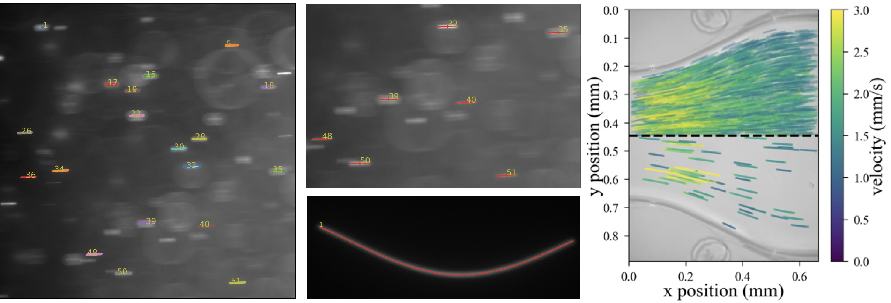

# FSVpy

This package is designed to locate and characterize fluorescent streaks in 
microscope images for flow velocimetry applications.  All of the features are 
demonstrated in the included jupyter notebook [fsvpy_tutorial](https://github.com/mmdriscoll/FSVPy/blob/main/fsvpy_tutorial.ipynb).  You can read more about the method in our [arXiv preprint](https://arxiv.org/abs/2209.01156). 


## Installation

FSVpy can be installed using pip:
```
pip install fsvpy
```
Required dependencies are pims, pandas, scikit-image, networkx.
